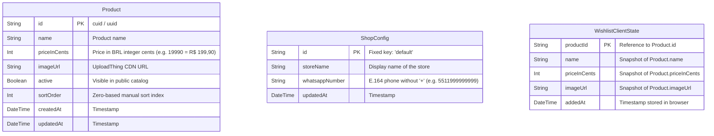

# Phase 1: Data Model

**Feature**: `001-catalogo-whatsapp` — Catálogo de Roupas com Canal WhatsApp  
**Date**: 2026-09-12  
**Status**: Ready

---

## 1. Entities & Schema Overview

The persistence layer uses **PostgreSQL (Neon)** managed via **Prisma ORM 7**. Client-side state (such as the customer's Wishlist) is stored in the browser's `localStorage`.



---

## 2. Prisma Schema Definition (`prisma/schema.prisma`)

```prisma
datasource db {
  provider = "postgresql"
  url      = env("DATABASE_URL")
}

generator client {
  provider = "prisma-client-js"
}

model Product {
  id           String   @id @default(cuid())
  name         String
  priceInCents Int
  imageUrl     String
  active       Boolean  @default(true)
  sortOrder    Int      @default(0)
  createdAt    DateTime @default(now())
  updatedAt    DateTime @updatedAt

  @@index([active, sortOrder])
  @@map("products")
}

model ShopConfig {
  id             String   @id @default("default")
  storeName      String   @default("Catálogo de Roupas")
  whatsappNumber String   @default("")
  updatedAt      DateTime @updatedAt

  @@map("shop_configs")
}
```

---

## 3. Entity Details & Validation Rules

### 3.1 `Product` (Piece of clothing in the catalog)

- **`id`** (`String`, Primary Key): CUID or UUID.
- **`name`** (`String`):
  - Required, trimmed.
  - Length: Min 2 characters, Max 120 characters.
  - No HTML tags / sanitized.
- **`priceInCents`** (`Int`):
  - Required integer representing currency in cents (e.g., R$ 89,90 → `8990`).
  - Validation: Positive integer, Min 1 cent (`priceInCents > 0`), Max R$ 1.000.000,00 (`100000000`).
- **`imageUrl`** (`String`):
  - Required valid HTTP/HTTPS URL from UploadThing domain (`https://utfs.io/*` or `https://ufs.sh/*`).
- **`active`** (`Boolean`):
  - Default: `true`.
  - Determines whether item is rendered on the public catalog.
- **`sortOrder`** (`Int`):
  - Default: `0`.
  - Determines sequential position on public catalog (`ORDER BY sortOrder ASC, createdAt DESC`).
  - Re-indexed upon drag-and-drop actions in admin.
- **`createdAt`** & **`updatedAt`**: Automatic timestamps.

### 3.2 `ShopConfig` (Store operational parameters)

- **`id`** (`String`, Primary Key): Fixed singleton value `"default"`. Guarantees exactly one configuration record in the system.
- **`storeName`** (`String`):
  - Store display name shown in header and meta tags. Min 2 chars, Max 80 chars.
- **`whatsappNumber`** (`String`):
  - Clean numeric international format without spaces, hyphens, or leading plus sign (e.g., `5511999999999` for Brazil DDD 11).
  - Validation regex: `^[1-9][0-9]{9,14}$`.
  - Empty string allowed initially; if empty, client catalog shows contact unavailable notice as per FR-019.
- **`updatedAt`**: Automatic timestamp.

### 3.3 `Wishlist` (Client-side entity in `localStorage`)

- **Storage Key**: `catalog_wishlist_items`
- **Schema Format (JSON array)**:
  ```typescript
  interface WishlistItem {
    id: string // Product id
    name: string // Product name snapshot
    priceInCents: number // Product price in cents
    imageUrl: string // Product image URL
    addedAt: number // Date.now() timestamp
  }
  ```
- **Validation & Rules**:
  - **Set Uniqueness**: A product ID can only appear once in the array. If user clicks "Adicionar à Lista de Desejos" on an already present product, operation is a no-op (silently ignored, feedback shows checkmark/added state).
  - **Total Price Calculation**: `total = items.reduce((sum, item) => sum + item.priceInCents, 0)`.
  - **Storage Fallback**: If `localStorage` is disabled/unavailable (e.g. strict incognito mode), maintain in-memory React state gracefully.

### 3.4 `AdminSession` (Virtual Authentication Token)

- **Storage**: HTTP-only secure cookie named `admin_session`.
- **Payload**:
  ```typescript
  interface AdminSessionToken {
    authenticated: true
    issuedAt: number
    sig: string // HMAC-SHA256(ADMIN_SESSION_SECRET, `${issuedAt}`)
  }
  ```
- **Validity**:
  - Cookie `Max-Age=315360000` (10 years, effectively permanent).
  - Validated by comparing computed signature with token signature using `crypto.timingSafeEqual`.
  - Cleared explicitly only upon calling `logoutAdminAction`.

---

## 4. State Transitions

### Product Lifecycle

```
[Draft in Admin Form]
       │
       ▼ (createProductAction)
   [Active (active = true, sortOrder = MAX + 1)]
       │
       ├──► (updateProductAction) ──► [Updated Details]
       │
       ├──► (reorderProductsAction) ──► [New sortOrder]
       │
       ▼ (deleteProductAction)
   [Deleted (hard delete from DB + async file cleanup)]
```
