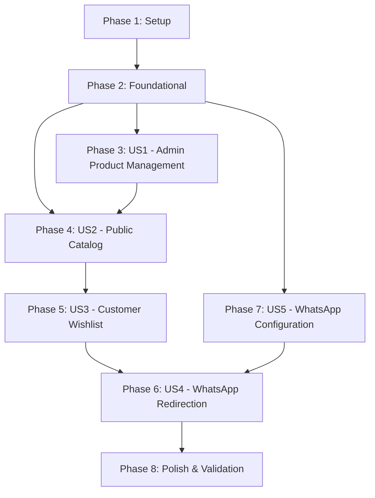

# Implementation Tasks: Catálogo de Roupas com Canal WhatsApp

**Feature**: `001-catalogo-whatsapp` — Catálogo de Roupas com Canal WhatsApp  
**Branch**: `001-catalogo-whatsapp` | **Date**: 2026-09-12 | **Spec**: [spec.md](./spec.md) | **Plan**: [plan.md](./plan.md)

---

## Phase 1: Setup (Shared Infrastructure)

**Purpose**: Project initialization, tooling configuration, and core library setup.

- [x] T001 Initialize Next.js 16.3.5 project with App Router, TypeScript, and Tailwind CSS v4 in repository root
- [x] T002 Install core dependencies (`@prisma/client`, `prisma`, `uploadthing`, `@uploadthing/react`, `@dnd-kit/core`, `@dnd-kit/sortable`, `lucide-react`, `clsx`, `tailwind-merge`) in `package.json`
- [x] T003 [P] Configure environment template `.env.example` (documenting `DATABASE_URL`, `ADMIN_PASSWORD`, `ADMIN_SESSION_SECRET`, `UPLOADTHING_TOKEN`) and update `.gitignore` per Constitution Principle IV
- [x] T004 [P] Configure Playwright E2E testing framework in `playwright.config.ts` supporting Desktop Chrome and Mobile Safari (iPhone SE 375x667 viewport)
- [x] T005 [P] Setup structured JSON logger utility in `src/shared/logger.ts` emitting ISO timestamp, severity, module name, and sanitized metadata per Constitution Principle VI
- [x] T006 [P] Implement currency formatting helper in BRL (`Intl.NumberFormat('pt-BR', { style: 'currency', currency: 'BRL' })`) and `cn` utility in `src/shared/utils.ts`

---

## Phase 2: Foundational (Blocking Prerequisites)

**Purpose**: Core infrastructure, database modeling, authentication, and file routing that MUST be complete before ANY user story can be implemented.

**⚠️ CRITICAL**: No user story work can begin until this phase is complete.

- [x] T007 Define Prisma schema with `Product` (fields: `id` cuid, `name` string 2-120 chars, `priceInCents` int > 0, `imageUrl` string, `active` boolean default true, `sortOrder` int default 0) and `ShopConfig` (fields: `id` default "default", `storeName` string 2-80 chars, `whatsappNumber` regex `^[1-9][0-9]{9,14}$`) in `prisma/schema.prisma`
- [x] T008 Initialize Prisma Client singleton with connection pooling support in `src/shared/db.ts`
- [x] T009 [P] Implement Admin authentication module (constant-time password verification via `crypto.timingSafeEqual`, HMAC-SHA256 session token signing, cookie helpers with permanent session `Max-Age=315360000`) in `src/modules/admin/auth.ts`
- [x] T010 [P] Configure UploadThing server router (`imageUploader`, max size "8MB", max file count 1, admin auth check) in `src/lib/uploadthing-server.ts` and route handler in `src/app/api/uploadthing/route.ts`
- [x] T011 [P] Configure UploadThing client components (`generateUploadButton`, `generateUploadDropzone`) in `src/lib/uploadthing-client.ts`
- [x] T012 Setup root layout, fonts, global Tailwind CSS styles, and friendly error boundary (offline / connection retry screen) in `src/app/layout.tsx`, `src/app/error.tsx`, and `src/app/globals.css`

**Checkpoint**: Foundation ready — user story implementation can now begin.

---

## Phase 3: User Story 1 — Vendedora gerencia o catálogo (Priority: P1) 🎯 MVP

**Goal**: A vendedora acessa o painel admin via senha, cadastra peças com foto, nome e preço, edita informações, remove peças e reordena a exibição via arrastar e soltar.

**Independent Test**: Fazer login no admin com `ADMIN_PASSWORD`, criar um produto com foto, alterar o preço, reordenar a lista e verificar que as operações persistem no banco.

### Tests for User Story 1

- [x] T013 [P] [US1] Create Playwright E2E test for admin password login, session persistence, product creation, editing, deletion, and drag-and-drop reorder in `tests/e2e/admin.spec.ts`

### Implementation for User Story 1

- [x] T014 [US1] Implement admin Server Actions (`loginAdminAction`, `logoutAdminAction`, `createProductAction`, `updateProductAction`, `deleteProductAction`, `reorderProductsAction`) with input validation and audit logging in `src/modules/admin/actions.ts`
- [x] T015 [P] [US1] Build admin login form component with error handling in `src/modules/admin/components/login-form.tsx` and login page in `src/app/admin/login/page.tsx`
- [x] T016 [P] [US1] Build product create/edit modal component with UploadThing dropzone and BRL price input in `src/modules/admin/components/product-form-modal.tsx`
- [x] T017 [US1] Build sortable product list table using `@dnd-kit/core` and `@dnd-kit/sortable` in `src/modules/admin/components/sortable-product-list.tsx` and item row in `src/modules/admin/components/sortable-product-item.tsx`
- [x] T018 [US1] Assemble admin dashboard page with auth verification, product list, and reorder trigger in `src/app/admin/page.tsx` and layout guard in `src/app/admin/layout.tsx`

**Checkpoint**: At this point, User Story 1 is fully functional and delivers the complete operational MVP for product management.

---

## Phase 4: User Story 2 — Cliente visualiza o catálogo (Priority: P1)

**Goal**: A cliente acessa a URL pública sem autenticação e visualiza os produtos ativos cadastrados em grade responsiva ordenada pela vendedora, com fotos, nomes e preços em BRL.

**Independent Test**: Acessar `http://localhost:3000` em desktop e em viewport móvel de 375px (iPhone SE), verificando renderização sem scroll horizontal, estados de skeleton e aviso amigável quando vazio.

### Tests for User Story 2

- [x] T019 [P] [US2] Create Playwright E2E test for public catalog display, skeleton loading states, empty catalog message, and 375px mobile responsiveness in `tests/e2e/catalog.spec.ts`

### Implementation for User Story 2

- [x] T020 [US2] Implement server-side catalog data query (`getCatalogProducts` filtering `active: true` ordered by `sortOrder ASC, createdAt DESC`) in `src/modules/catalog/queries.ts`
- [x] T021 [P] [US2] Build product card component displaying photo, name, formatted BRL price, and image fallback in `src/modules/catalog/components/product-card.tsx`
- [x] T022 [P] [US2] Build responsive product grid (1 column on mobile 375px, 2-3 columns on tablet/desktop) and friendly empty state message in `src/modules/catalog/components/product-grid.tsx`
- [x] T023 [P] [US2] Build skeleton loading component with CSS pulse animation for product cards in `src/modules/catalog/components/skeleton-grid.tsx`
- [x] T024 [US2] Assemble public catalog Server Component page with streaming suspense in `src/app/page.tsx`

**Checkpoint**: User Stories 1 and 2 are functional — the vendedora can populate products and clients can browse them seamlessly.

---

## Phase 5: User Story 3 — Cliente monta sua Lista de Desejos (Priority: P2)

**Goal**: A cliente adiciona peças à sua Lista de Desejos com feedback visual imediato, visualiza os itens selecionados com fotos e total acumulado, remove itens e os dados persistem no navegador.

**Independent Test**: Adicionar 2 peças distintas à lista, verificar atualização do badge e cálculo do total; tentar adicionar item repetido e verificar desduplicação silenciosa; remover um item; recarregar a página e confirmar persistência via `localStorage`.

### Tests for User Story 3

- [x] T025 [P] [US3] Create Playwright E2E test for wishlist addition, silent duplicate prevention, item removal, total calculation, and `localStorage` persistence in `tests/e2e/wishlist.spec.ts`

### Implementation for User Story 3

- [x] T026 [US3] Implement Wishlist React Context and custom hook (`useWishlist`) with `catalog_wishlist_items` storage key, deduplication logic, and hydration protection in `src/modules/wishlist/context.tsx`
- [x] T027 [P] [US3] Build floating/header wishlist trigger button with badge counter and visual pulse animation in `src/modules/wishlist/components/wishlist-floating-button.tsx`
- [x] T028 [P] [US3] Build wishlist item row component with thumbnail, name, price, and remove button in `src/modules/wishlist/components/wishlist-item-row.tsx`
- [x] T029 [US3] Build wishlist drawer/modal displaying selected items, subtotal, empty state message, and clear button in `src/modules/wishlist/components/wishlist-drawer.tsx`
- [x] T030 [US3] Integrate wishlist provider into `src/app/layout.tsx` and "Adicionar à Lista de Desejos" button feedback into `src/modules/catalog/components/product-card.tsx`

**Checkpoint**: User Story 3 complete — clients can curate pieces and view their accumulated total locally.

---

## Phase 6: User Story 4 — Cliente envia a Lista de Desejos ao WhatsApp da vendedora (Priority: P2)

**Goal**: Ao clicar em "Enviar para a vendedora" na Lista de Desejos, a cliente é redirecionada ao WhatsApp com mensagem pré-formatada contendo saudação, nome, preço, link de foto de cada peça e total.

**Independent Test**: Montar uma lista com 2 peças, clicar no botão de envio e verificar que a URL gerada direciona para `https://wa.me/{number}` com o texto pré-formatado contendo nomes, preços, links de foto e total correto.

### Tests for User Story 4

- [x] T031 [P] [US4] Create Playwright E2E test asserting WhatsApp link construction, encoded message format, and empty-state button disabling in `tests/e2e/whatsapp.spec.ts`

### Implementation for User Story 4

- [x] T032 [US4] Implement WhatsApp message formatter and URL builder with polite Portuguese greeting, individual item lines (name + price + direct image URL), total BRL, device platform detection, and safe length truncation guard in `src/modules/wishlist/whatsapp.ts`
- [x] T033 [US4] Integrate WhatsApp dispatch action into wishlist drawer button with disabled state when empty or number unconfigured in `src/modules/wishlist/components/wishlist-drawer.tsx`

**Checkpoint**: User Story 4 complete — the core conversion funnel (Catalog → Wishlist → WhatsApp) is fully operational.

---

## Phase 7: User Story 5 — Vendedora configura o número de WhatsApp (Priority: P3)

**Goal**: A vendedora configura no painel admin o número de WhatsApp de destino (formato internacional com DDD) e o nome da loja, refletindo imediatamente no catálogo e nos redirecionamentos.

**Independent Test**: Configurar o número no painel admin, verificar o salvamento no banco e validar que o botão do WhatsApp no catálogo passa a utilizar o novo número.

### Tests for User Story 5

- [x] T034 [P] [US5] Create Playwright E2E test for store WhatsApp number and store name configuration in `tests/e2e/store-config.spec.ts`

### Implementation for User Story 5

- [x] T035 [US5] Implement store settings Server Action (`updateShopConfigAction`) with phone number validation (regex `^[1-9][0-9]{9,14}$`) and query (`getShopConfig`) in `src/modules/admin/actions.ts` and `src/modules/catalog/queries.ts`
- [x] T036 [US5] Build store settings form component with phone number formatting and feedback in `src/modules/admin/components/store-settings-form.tsx` and embed into `src/app/admin/page.tsx`
- [x] T037 [US5] Connect dynamic store WhatsApp number and store name to public catalog header and WhatsApp redirect button in `src/app/page.tsx`

**Checkpoint**: All user stories (US1–US5) are implemented and functional.

---

## Phase 8: Polish & Cross-Cutting Concerns

**Purpose**: Verification of quality gates, security policies, performance, and constitutional compliance.

- [x] T038 [P] Audit environment files and git tracking to guarantee zero secrets in source code (`.env` in `.gitignore`, `.env.example` with placeholders) per Constitution Principle IV
- [x] T039 [P] Audit functions across all modules for Single Responsibility and length limits (≤ 40 lines) per Constitution Principle I
- [x] T040 Execute complete Playwright E2E test suite across Desktop and Mobile viewports verifying all scenarios from `specs/001-catalogo-whatsapp/quickstart.md`
- [x] T041 Run manual quickstart validation checklist in `specs/001-catalogo-whatsapp/quickstart.md` and document results

---

## Dependencies & Execution Order

### Phase Dependencies

- **Setup (Phase 1)**: Can start immediately.
- **Foundational (Phase 2)**: Depends on Phase 1. Blocks all user stories.
- **User Story 1 (P1)**: Depends on Phase 2. Delivers operational MVP.
- **User Story 2 (P1)**: Depends on Phase 2 (and reads products created in US1).
- **User Story 3 (P2)**: Depends on Phase 4 (client selects catalog products into wishlist).
- **User Story 4 (P2)**: Depends on Phase 5 (wishlist items) and Phase 7 (WhatsApp number).
- **User Story 5 (P3)**: Depends on Phase 2 (admin authentication & store config model).
- **Polish (Phase 8)**: Depends on completion of all user stories.

---

## Parallel Opportunities

### Within Setup (Phase 1)

- T003 (`.env.example`), T004 (`playwright.config.ts`), T005 (`logger.ts`), and T006 (`utils.ts`) can all be built in parallel.

### Within Foundational (Phase 2)

- T009 (`auth.ts`), T010 (`uploadthing-server.ts`), and T011 (`uploadthing-client.ts`) can be built in parallel once Prisma models (T007) and DB singleton (T008) are defined.

### Within User Stories

- **US1**: T013 (E2E test), T015 (login form), and T016 (product modal) can be created in parallel.
- **US2**: T019 (E2E test), T021 (product card), T022 (product grid), and T023 (skeleton) can be created in parallel.
- **US3**: T025 (E2E test), T027 (floating button), and T028 (item row) can be created in parallel.

---

## Implementation Strategy

### MVP First (Phases 1, 2, and 3)

1. Complete Phase 1 (Setup) and Phase 2 (Foundational).
2. Complete Phase 3 (User Story 1 — Admin Product Management).
3. **STOP and VALIDATE**: Vendedora can log in, upload clothing photos, set prices, and reorder items. The catalog has data.

### Incremental Delivery

1. **Increment 1 (MVP)**: Vendedora manages clothes via admin (US1).
2. **Increment 2**: Customers can view the catalog online on mobile and desktop (US2).
3. **Increment 3**: Customers can build a Wishlist with real-time total (US3).
4. **Increment 4**: Customers transfer their Wishlist directly to WhatsApp (US4 + US5).
5. **Increment 5**: Full automated Playwright test suite and constitutional quality audit (Polish).
