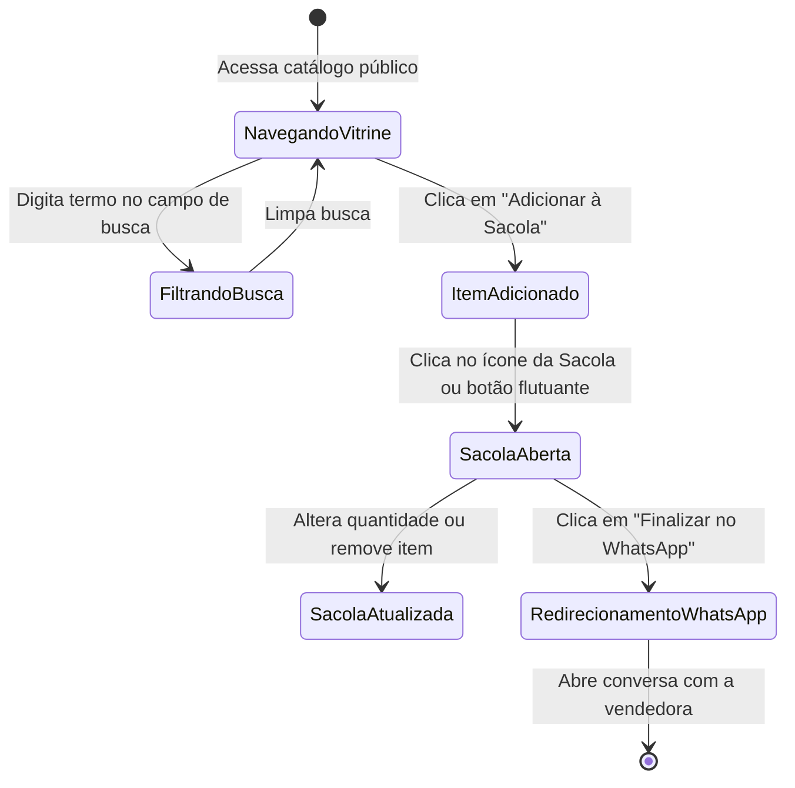

# Data Model: Layout Moderno Inspirado na Canal Concept

**Feature Branch**: `002-layout-canal-concept`
**Date**: 2026-09-13

Este documento descreve as entidades, modelos de dados e regras de validação para a vitrine e experiência de compra inspiradas na Canal Concept.

---

## 1. Entidades do Domínio

### 1.1 Product (Peça de Vestuário)
Representa a peça de roupa exibida na vitrine da Canal Concept.

```prisma
model Product {
  id           String   @id @default(cuid())
  name         String
  priceInCents Int
  imageUrl     String
  active       Boolean  @default(true)
  sortOrder    Int      @default(0)
  createdAt    DateTime @default(now())
  updatedAt    DateTime @updatedAt

  @@index([active, sortOrder])
  @@map("products")
}
```

#### Regras de Validação & Atributos:
- `name`: String não vazia, min 2 caracteres, max 120 caracteres. Exibida em caixa alta ou estilo editorial nos cartões.
- `priceInCents`: Inteiro positivo representando centavos de BRL (ex.: R$ 399,90 = `39990`).
- `imageUrl`: URL válida de imagem pública (Cloudinary, UploadThing ou URL HTTPS externa).
- `active`: Booleano indicando disponibilidade. Itens inativos não aparecem na vitrine da cliente.
- `sortOrder`: Inteiro ordenando a prioridade visual na grade.

---

### 1.2 ShopConfig (Configurações da Loja & Barra de Avisos)
Configurações operacionais associadas à vitrine Canal Concept.

```prisma
model ShopConfig {
  id              String   @id @default("default")
  storeName       String   @default("Canal Concept")
  whatsappNumber  String   @default("")
  topAnnouncement String   @default("FRETE GRÁTIS ACIMA DE R$ 599,00 | PARCELE EM ATÉ 10X SEM JUROS | 5% OFF NO PIX")
  updatedAt       DateTime @updatedAt

  @@map("shop_configs")
}
```

#### Regras de Validação & Atributos:
- `storeName`: Fixado como `"Canal Concept"` na interface pública.
- `whatsappNumber`: String contendo apenas dígitos do DDI + DDD + número (ex.: `"5511999999999"`). Usado para gerar o link do WhatsApp.
- `topAnnouncement`: Texto exibido na barra superior de avisos (máx. 255 caracteres).

---

### 1.3 WishlistItem (Item da Sacola de Desejos — Client State)
Estado local persistido na sessão da cliente (armazenado via `localStorage` e gerenciado no navegador).

```typescript
export interface WishlistItem {
  productId: string;
  name: string;
  priceInCents: number;
  imageUrl: string;
  quantity: number;
}
```

#### Regras de Comportamento:
- A cliente pode adicionar o mesmo item múltiplas vezes (incrementa `quantity`) ou remover itens.
- Não há seleção de tamanho prévia (o alinhamento de tamanho ocorre na conversa do WhatsApp).
- O cálculo do subtotal geral é a soma de `(priceInCents * quantity)` de todos os itens.

---

## 2. Transições de Estado


