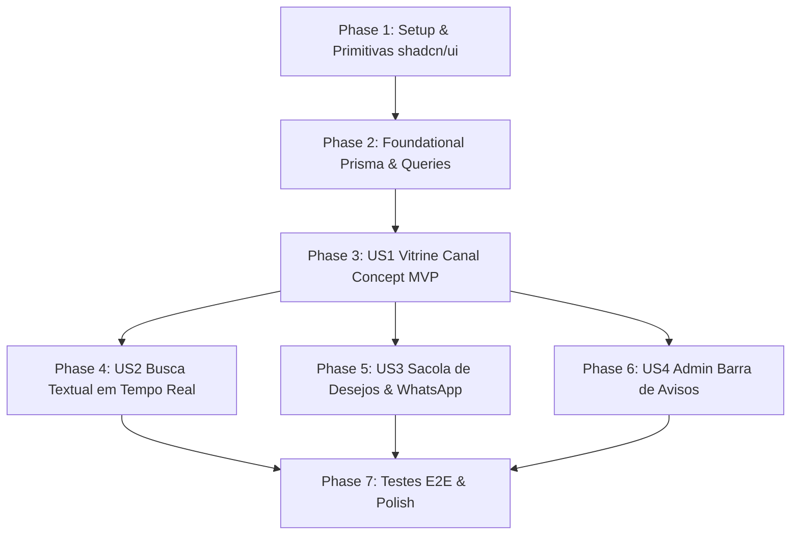

# Tasks: Layout Moderno e Atualizado Inspirado na Canal Concept

**Feature Branch**: `002-layout-canal-concept`
**Spec**: [spec.md](./spec.md) | **Plan**: [plan.md](./plan.md)

---

## Phase 1: Setup (Shared Infrastructure & Design Primitives)

**Purpose**: Inicialização de tokens de design e componentes primitivos no padrão shadcn/ui.

- [X] T001 Configure Tailwind CSS v4 design tokens, color variables (`#F7F7F7`, `#111111`, `#E2E2E2`), and typography utilities in `src/app/globals.css`
- [X] T002 [P] Implement shadcn/ui `Button` component with luxury minimal styling in `src/shared/components/ui/button.tsx` per contract `specs/002-layout-canal-concept/contracts/ui-components.contract.ts`
- [X] T003 [P] Implement shadcn/ui `Input` component with clean borders in `src/shared/components/ui/input.tsx` per contract `specs/002-layout-canal-concept/contracts/ui-components.contract.ts`
- [X] T004 [P] Implement shadcn/ui `Badge` component with high-tracking uppercase styling in `src/shared/components/ui/badge.tsx` per contract `specs/002-layout-canal-concept/contracts/ui-components.contract.ts`
- [X] T005 [P] Implement shadcn/ui `Sheet` (Drawer) component for sliding panels in `src/shared/components/ui/sheet.tsx` per contract `specs/002-layout-canal-concept/contracts/ui-components.contract.ts`

---

## Phase 2: Foundational (Blocking Prerequisites)

**Purpose**: Estrutura de dados e queries essenciais antes da implementação das histórias de usuário.

**⚠️ CRITICAL**: Nenhuma história de usuário deve ser iniciada antes da conclusão desta fase.

- [X] T006 Update Prisma schema in `prisma/schema.prisma` to include `topAnnouncement` (String @default("FRETE GRÁTIS ACIMA DE R$ 599,00 | PARCELE EM ATÉ 10X SEM JUROS | 5% OFF NO PIX")) in `ShopConfig` model
- [X] T007 Update database queries and fallbacks in `src/modules/catalog/queries.ts` to fetch and return `topAnnouncement` alongside `storeName` ("Canal Concept") and `whatsappNumber`

**Checkpoint**: Base de componentes e banco de dados pronta — implementação das histórias de usuário desbloqueada.

---

## Phase 3: User Story 1 - Cliente visualiza a vitrine com estética visual oficial Canal Concept (Priority: P1) 🎯 MVP

**Goal**: Apresentar a vitrine com a identidade visual e sofisticação da Canal Concept: barra superior de benefícios, cabeçalho com logo oficial, fundo neutro `#F7F7F7` e cartões verticais (3:4) com preço em R$ e parcelamento em até 10x.

**Independent Test**: Acessar `http://localhost:3000` e verificar a presença da barra de comunicados, logotipo oficial da Canal Concept, proporção vertical 3:4 das fotos e exibição das condições de pagamento em layout responsivo.

- [X] T008 [P] [US1] Create top announcement bar component with uppercase tracking typography in `src/modules/catalog/components/top-announcement-bar.tsx`
- [X] T009 [P] [US1] Create official Canal Concept vector SVG logo component in `src/modules/catalog/components/canal-logo.tsx`
- [X] T010 [US1] Build modern editorial product card component with 3:4 vertical aspect ratio, BRL price, installment calculation ("em até 10x sem juros") and PIX discount highlight in `src/modules/catalog/components/product-card.tsx`
- [X] T011 [US1] Update responsive product grid component (2 columns on mobile, 3-4 on desktop) in `src/modules/catalog/components/product-grid.tsx`
- [X] T012 [US1] Update skeleton loading grid component matching 3:4 vertical editorial cards in `src/modules/catalog/components/skeleton-grid.tsx`
- [X] T013 [US1] Refactor main public page layout in `src/app/page.tsx` integrating top announcement bar, Canal Concept header, and product showcase

**Checkpoint**: Vitrine oficial Canal Concept 100% navegável e responsiva (MVP entregue).

---

## Phase 4: User Story 2 - Cliente pesquisa peças e filtra a vitrine por busca textual rápida (Priority: P1)

**Goal**: Permitir que a cliente encontre qualquer roupa instantaneamente através de busca por texto em tempo real no cabeçalho.

**Independent Test**: Digitar um termo na busca do cabeçalho, validar a atualização dinâmica dos produtos na grade e testar termo inexistente verificando o estado vazio e botão para restaurar a vitrine.

- [X] T014 [US2] Implement dynamic search input and debounced query state in `src/modules/catalog/components/canal-header.tsx`
- [X] T015 [US2] Integrate search filtering and empty state handling with "Ver Todas as Peças" action in `src/modules/catalog/components/product-grid.tsx`

**Checkpoint**: Busca em tempo real totalmente operacional na vitrine.

---

## Phase 5: User Story 3 - Cliente gerencia a Sacola de Desejos e envia para o WhatsApp (Priority: P2)

**Goal**: Possibilitar adição à sacola com 1 clique direto (sem grade de tamanho no catálogo), visualização em gaveta lateral deslizante (*Sheet*) e encaminhamento direto para o WhatsApp oficial da vendedora.

**Independent Test**: Clicar em "Adicionar à Sacola" em dois produtos, abrir o painel lateral deslizante, conferir itens e valor total e clicar em "Finalizar no WhatsApp" validando a mensagem formatada.

- [X] T016 [P] [US3] Update WhatsApp message generator utility in `src/modules/wishlist/utils.ts` per contract `specs/002-layout-canal-concept/contracts/whatsapp-message.contract.ts`
- [X] T017 [P] [US3] Update item row component in `src/modules/wishlist/components/wishlist-item-row.tsx` with editorial thumbnail, quantity adjustment, and remove action
- [X] T018 [US3] Refactor sliding drawer component using shadcn Sheet in `src/modules/wishlist/components/wishlist-drawer.tsx`
- [X] T019 [US3] Update wishlist floating button with luxury badge counter in `src/modules/wishlist/components/wishlist-floating-button.tsx`
- [X] T020 [US3] Connect one-click "Adicionar à Sacola" action on `src/modules/catalog/components/product-card.tsx` to Wishlist Context

**Checkpoint**: Fluxo completo de conversão Sacola de Desejos → WhatsApp finalizado.

---

## Phase 6: User Story 4 - Vendedora personaliza avisos da barra de topo e WhatsApp (Priority: P3)

**Goal**: Permitir que a vendedora ou administradora gerencie o texto da barra superior e o telefone de WhatsApp no painel `/admin`.

**Independent Test**: Acessar `/admin`, alterar a mensagem da barra de topo e o WhatsApp, salvar e validar na vitrine pública.

- [X] T021 [US4] Update admin shop configuration form to manage `topAnnouncement` and WhatsApp number in `src/modules/admin/components/shop-config-form.tsx`
- [X] T022 [US4] Update admin server actions to persist `topAnnouncement` in `src/modules/admin/actions.ts`

**Checkpoint**: Painel gerencial atualizado e integrado com a barra de topo.

---

## Phase 7: Polish & Cross-Cutting Concerns

**Purpose**: Testes automatizados, validação de acessibilidade e garantia de qualidade.

- [X] T023 [P] Create Playwright E2E automated test suite in `tests/canal-layout.spec.ts` covering Canal Concept branding, search filtering, and wishlist WhatsApp checkout
- [X] T024 Run end-to-end verification following `specs/002-layout-canal-concept/quickstart.md`
- [X] T025 Code cleanup, linting verification (`npm run lint`), and removing obsolete styling

---

## Dependencies & Execution Order

### Oportunidades de Execução Paralela
- Primitivas shadcn/ui (`T002`, `T003`, `T004`, `T005`) podem ser construídas em paralelo.
- Componente da barra de topo (`T008`) e Logo oficial SVG (`T009`) podem ser criados em paralelo.
- Utilitário do WhatsApp (`T016`) e Linha do item da sacola (`T017`) podem ser desenvolvidos em paralelo.
- Testes E2E (`T023`) podem ser elaborados em paralelo à finalização visual.

---

## Implementation Strategy

### MVP First (User Story 1)
1. Completar **Phase 1: Setup** e **Phase 2: Foundational**.
2. Implementar **Phase 3: User Story 1**.
3. **Validar MVP**: Abrir `http://localhost:3000` e confirmar o visual completo da vitrine Canal Concept.
4. Seguir incrementalmente para busca (US2), sacola/WhatsApp (US3) e admin (US4).
